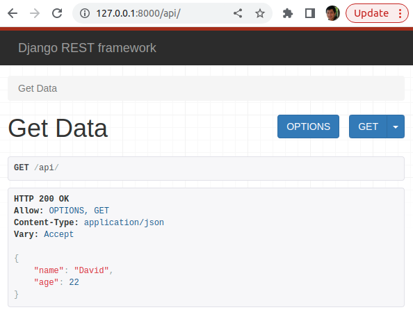

# create book app
1. create project

```bash
$django-admin startproject myproject
$cd myproject/
```

# create function based API
2. install django-rest-framework 
```bash
$pip install djangorestframework
```
3. create api app using this folder structure
```bash
./api
├── __init__.py
└── views.py
```
add app in settings
```python
INSTALLED_APPS = [
    'django.contrib.admin',
    'django.contrib.auth',
    'django.contrib.contenttypes',
    'django.contrib.sessions',
    'django.contrib.messages',
    'django.contrib.staticfiles',
    'rest_framework',
    'api',
]
```
4. create get_data fucntion
```python
#views.py
from rest_framework.response import Response
from rest_framework.decorators import api_view


@api_view(['GET'])
def get_data(request):
    data={'name':'David', 'age':22}
    return Response(data)

```
5. route app url
```python
#myproject/api/urls.py
from django.urls import path
from . import views

urlpatterns = [
    path('', views.get_data),
]
```
6. route project url
```python
#myproject/urls.py
from django.contrib import admin
from django.urls import path, include

urlpatterns = [
    path('admin/', admin.site.urls),
    path('api/', include('api.urls'))
]
```
7. run server to check results
go to http://127.0.0.1:8000/api/


# Test Results
8. run server
```bash
python manage.py runserver
```
9. go to api page http://127.0.0.1:8000/api/

