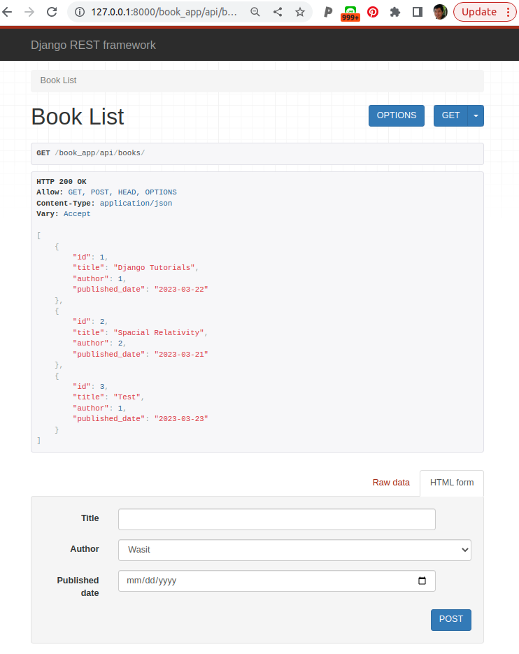

# create book app
1. create project

```bash
$django-admin startproject myproject
$cd myproject/
```

2. create book_app

```bash
$python manage.py startapp book_app
```

register app in settings.py
```python
#settings.py
INSTALLED_APPS = [
    'django.contrib.admin',
    'django.contrib.auth',
    'django.contrib.contenttypes',
    'django.contrib.sessions',
    'django.contrib.messages',
    'django.contrib.staticfiles',
    'book_app',
```

3. create models
```python
#models.py
from django.db import models

class Author(models.Model):
    name = models.CharField(max_length=100)
    email = models.EmailField()

    def __str__(self):
        return self.name

class Book(models.Model):
    title = models.CharField(max_length=200)
    author = models.ForeignKey(Author, on_delete=models.CASCADE)
    published_date = models.DateField()

    def __str__(self):
        return self.title
```
4. register admin
```python
from django.contrib import admin
from .models import Author, Book

admin.site.register(Author)
admin.site.register(Book)
```
5. migrations and create superuser
```bash
$python manage.py makemigrations
$python manage.py migrate
$python manage.py createsuperuser
```

6. run server to check the admin page
```bash
python manage.py runserver
```

go to http://127.0.0.1:8000/admin/ 

# create class based API
7. install django_rest_api
```python
#settings.py
INSTALLED_APPS = [
    'django.contrib.admin',
    'django.contrib.auth',
    'django.contrib.contenttypes',
    'django.contrib.sessions',
    'django.contrib.messages',
    'django.contrib.staticfiles',
    'rest_framework',
    'book_app',
]
```
8. book serializer
```python
#/myproject/book_app/serializers.py
from rest_framework import serializers
from .models import Book

class BookSerializer(serializers.ModelSerializer):
    class Meta:
        model = Book
        fields = ['id', 'title', 'author', 'published_date']
```
9. book class based views
```python
#/myproject/book_app/views.py
from rest_framework import generics
from .models import Book
from .serializers import BookSerializer

class BookList(generics.ListCreateAPIView):
    queryset = Book.objects.all()
    serializer_class = BookSerializer

class BookDetail(generics.RetrieveUpdateDestroyAPIView):
    queryset = Book.objects.all()
    serializer_class = BookSerializer
```
10. route url
```python
#/mayproject/book_app/urls.py
from django.urls import path
from . import views
from book_app.views import BookList, BookDetail

urlpatterns = [
    path('', views.get_data),
    path('api/books/', BookList.as_view()),
    path('api/book/<int:pk>/', BookDetail.as_view()),
]
```
11. run server to check results
gp to  http://127.0.0.1:8000/book_app/api/books/
12. add serializer, views and url for author
check github https://github.com/wasit7/dsi202_2023/tree/main/Lesson06%20REST%20API

# create html for front end
13. HTML template /myproject/book_app/templates/book_list.html
```html

<!DOCTYPE html>
<body>
<form id="book-form">
    <label for="author">Select an author:</label>
    <select id="author" name="author">
    
        <option value="{{ author.id }}">{{ author.name }}</option>
    
    </select>
    <!-- <button type="submit">Get Books</button> -->
</form>

<ul id="book-list"></ul>

<script src=""></script>
```
14. Javascript /myproject/book_app/static/js/main.js
```js
// Get a reference to the form and the book list
const bookForm = document.querySelector('#book-form');
const bookList = document.querySelector('#book-list');

// Listen for the form submission event
bookForm.addEventListener('change', (event) => {
  event.preventDefault();

  // Get the selected author ID from the form
  const authorId = document.querySelector('#author').value;

  // Send an AJAX request to the server to get the list of books by author
  fetch(`/book_app/api/authors/${authorId}/`)
    .then(response => response.json())
    .then(author => {
      // Clear the previous book list
      bookList.innerHTML = '';

      // Add each book to the book list
      author.books.forEach(book => {
        const li = document.createElement('li');
        li.textContent = book.title;
        bookList.appendChild(li);
      });
    });
});
```

15. add view
```python
#/myproject/book_app/views.py
from django.shortcuts import render
def book_list(request):
    authors = Author.objects.all()
    return render(request, 'book_list.html', {'authors': authors})
```
16. server staticfiles 
please see source code /myproject/book_app/static/

17. check results at http://127.0.0.1:8000/book_app/api/books/


