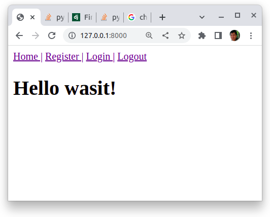

# Setup Project
## setup environment
```
$conda activate -n dsi202_2023
```

## create project
```
$django-admin startproject myproject
$cd myproject
```

## create apps
```
$python manage.py startapp myapp
$mkdir ./myapp/templates
mkdir ./myapp/sale
```
## insall apps
```python
#/myproject/settings.py
...
INSTALLED_APPS = [
    ...,
    'myapp',
    'sale',
    'django_extensions',
]
```

## create static and media folders
```
$mkdir ./media
$mkdir ./static
```

## config static and media
```python
#/myproject/settings.py
...
import os
STATIC_URL = '/static/'
STATICFILES_DIRS = [
    os.path.join(BASE_DIR, 'static'),
]
MEDIA_URL = '/media/'
MEDIA_ROOT  = os.path.join(BASE_DIR, 'media')
```

## config urls
```python
#/myproject/urls.py
...
from django.contrib import admin
from django.urls import path, include

urlpatterns = [
    path('admin/', admin.site.urls),
    path('sale/', include('sale.urls')),
    path('', include('myapp.urls'))
]
from django.conf import settings
from django.conf.urls.static import static
urlpatterns = urlpatterns + static(settings.STATIC_URL, document_root=settings.STATIC_ROOT)
urlpatterns = urlpatterns + static(settings.MEDIA_URL, document_root=settings.MEDIA_ROOT)
```

```python
#/myproject/myapp/urls.py
#/myproject/sale/urls.py
from django.urls import path
from . import views

urlpatterns = [
    
]
```

# Build myapp

## create forms
```python
#/myproject/myapp/forms.py
from django import forms
from django.contrib.auth.forms import UserCreationForm, AuthenticationForm
from django.contrib.auth.models import User

class MyRegistrationForm(UserCreationForm):
    email = forms.EmailField(required=True)
    first_name = forms.CharField(required=True)
    last_name = forms.CharField(required=True)

    class Meta:
        model = User
        fields = ('username', 'email', 'first_name', 'last_name', 'password1', 'password2')

class MyLoginForm(AuthenticationForm):
    class Meta:
        model = User
        fields = ('username', 'password')
```
## create views
```python
#/myproject/myapp/views.py
from django.shortcuts import render, redirect
from django.contrib.auth import authenticate, login, logout
from .forms import MyRegistrationForm, MyLoginForm

def home(request):
    return render(request, 'home.html', {'user': request.user})

def myregister(request):
    if request.method == 'POST':
        form = MyRegistrationForm(data=request.POST)
        print(request.POST)
        if form.is_valid():
            form.save()
            # username = form.cleaned_data.get('username')
            # raw_password = form.cleaned_data.get('password1')
            # user = authenticate(username=username, password=raw_password)
            login(request, user)
            return redirect('home')
    else:
        form = MyRegistrationForm()
    return render(request, 'register.html', {'form': form})

def mylogin(request):
    if request.method == 'POST':
        form = MyLoginForm(data=request.POST)
        if form.is_valid():
            username = form.cleaned_data.get('username')
            raw_password = form.cleaned_data.get('password')
            user = authenticate(username=username, password=raw_password)
            login(request, user)
            return redirect('home')
    else:
        form = MyLoginForm()
    return render(request, 'login.html', {'form': form})


def mylogout(request):
    logout(request)
    return redirect('home')
```
## templates
```html
<!-- /myproject/myapp/home.html -->
<a href=""> Home </a>
<a href=""> Register </a>
<a href=""> Login </a>
<a href=""> Logout </a>
<h1>Hello {{user}}!</h1>

<!-- /myproject/myapp/register.html -->
<form method="post"> 
     
    {{ form.as_p }} 
    <button type="submit">Submit</button> 
</form> 

<!-- /myproject/myapp/login.html -->
<form method="post"> 
     
    {{ form.as_p }} 
    <button type="submit">Submit</button> 
</form> 
```
## setup urls
```python
#myproject/myapp/urls.py
from django.urls import path
from . import views

urlpatterns = [
    path('', views.myhome, name='home'),
    path('register/', views.myregister, name='register'),
    path('login/', views.mylogin, name='login'),
    path('logout/', views.mylogout, name='logout'),
]
```
## runserver 


# build sale app
##